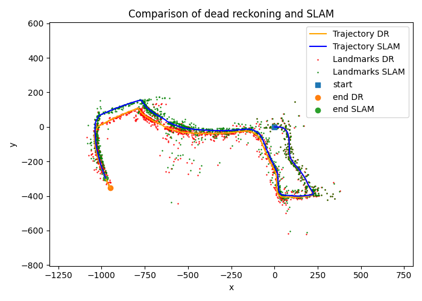
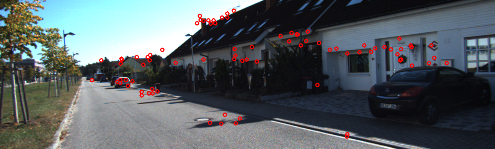
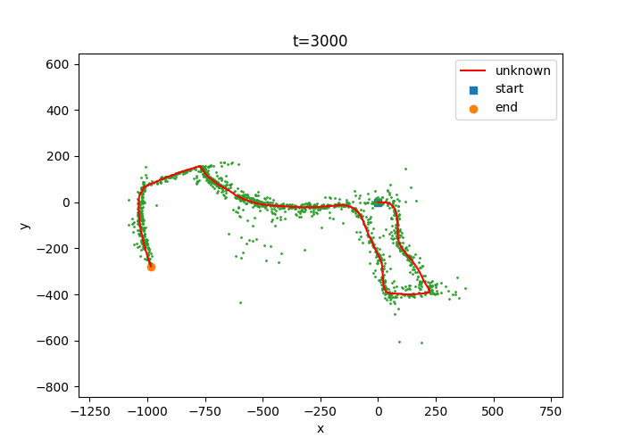
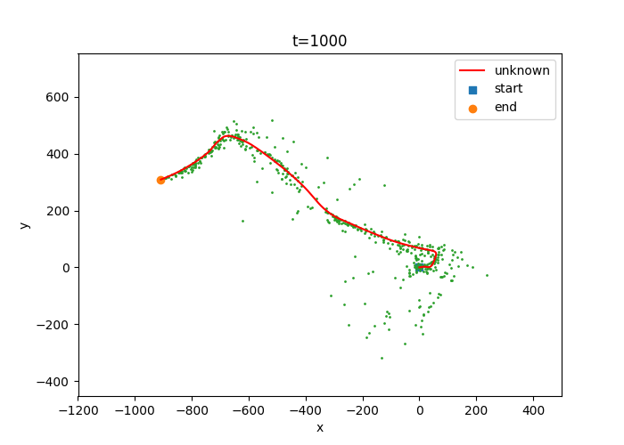

# Visual-Inertial SLAM via EKF

The Simultaneous Localization and Mapping (SLAM) problem has been one of the most popular research areas from
its coinage. With the breakthrough of robotics and the usage
of many related smart devices and observation sensors, the
problem of accurately locating the device and building a realtime map of its surrounding environment becomes a popular
subject with dense literature in finding a way to best utilize
all the collected data and recover the trajectory and the map.
Among many proposed solutions, visual-inertial SLAM is one
approach that takes advantage of IMU and stereo camera
measurements to robustly perform this task. In this project, we
discuss how to implement visual-inertial SLAM on a moving
vehicle equipped with the camera and IMU.

This project implements visual-inertial simultaneous localization and mapping (SLAM) using an extended Kalman filter
(EKF). Using synchronized measurements from an
inertial measurement unit (IMU) and visual landmark features
extracted from a stereo camera provided with its intrinsic
and extrinsic calibration equipped on a vehicle, I estimated its
trajectory and reconstructed the landmarks of its surrounding
environment via two approaches. I first solved this problem by
separating out the localization and visual mapping tasks and
solving them individually to obtain a dead reckoning result, then compared this result with EKF approach which considers the
correlation between the landmarks and the vehicle.

## Project Report 
* [Gaopo Huang. "Visual-inertial SLAM via Extended Kalman Filter". UCSD, student paper](./report/ProjectReport_Gaopo.pdf)

## Visualization 
* Implemented SLAM output for vechicle trajectory and feature mapping.

## File structure

├── code  
│   ├── training  
│   │   ├── `main.py`: #Visual inertial SLAM implementation  
│   │   ├── `pr3_util.py`:  #Helper functions for graphing and pose kinematics   
├── data  #Contains all the train data   
├── dataset03figs   
│   │   ├── LocalizationOnly #part(a)  
│   │   ├── MapOnly_W1E-02_V_02_lm_05 #part(b)  
│   │   ├── SLAM_W1E-02_V_02_lm_05 #part(c) SLAM only  
│   │   ├── Comparison_W1E-02_V_02_lm_05 #part(c) SLAM vs trajectory  
│   │   └── ...     
├── dataset10figs  
│   │   ├── LocalizationOnly #part(a)  
│   │   ├── MapOnly_W1E-02_V_02_lm_05 #part(b)  
│   │   ├── SLAM_W1E-02_V_02_lm_05 #part(c) SLAM only  
│   │   ├── Comparison_W1E-02_V_02_lm_05 #part(c) SLAM vs trajectory  
│   │   └── ...    
├── imgs  
├── reports      
│── README.md    

## Usage 

`main.py` provides the basic visual-inertial SLAM implementation. It can run the dead reckoning prediction and update steps and also visual-inertial SLAM combined. Some parameters that can be set in the main file before running:
> - `full_evaluate`: test different noise tuning.
> - `live_plot_update`: show a live updating plot
> - `subsample_rate`: subsampling the feature files
> - `save_freq`: save figure frequency
> - All noise tuning including W, V, and landmark covariance initialization noise